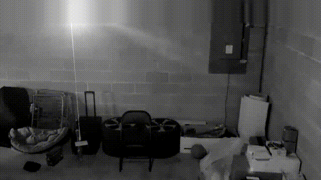

# 2020 <a href="https://codebreaker.ltsnet.net" target="_top">NSA Codebreaker Challenge</a>
<!---->

  

| Task 6 - Proof of Life - (Signals Analysis)| Points: 1300 |
|:------------------------------------------ | -----------: |

>Satellite imaging of the location you identified shows a camouflaged building within the jungle. The recon team spotted multiple armed individuals as well as drones being used for surveillance. Due to this heightened security presence, the team was unable to determine whether or not the journalist is being held inside the compound. Leadership is reluctant to raid the compound without proof that the journalist is there.

>The recon team has brought back a signal collected near the compound. They suspect it is a security camera video feed, likely encoded with a systematic Hamming code. The code may be extended and/or padded as well. We've used BPSK demodulation on the raw signal to generate a sequence of half precision floating point values. The floats are stored as IEEE 754 binary16 values in little-endian byte order within the attached file. Each float is a sample of the signal with 1 sample per encoded bit. You should be able to interpret this to recover the encoded bit stream, then determine the Hamming code used. Your goal for this task is to help us reproduce the original video to provide proof that the journalist is alive and being held at this compound.

>Downloads:

* [Collected Signal (signal.ham)](./Files/signal.ham)

**Solution:**

>The size of the signal.ham file is 19198236 bytes or 153585888 bits. As inferred from the task description, each 16 bits in the file are in [IEEE 754 binary16](https://en.wikipedia.org/wiki/Half-precision_floating-point_format#IEEE_754_half-precision_binary_floating-point_format:_binary16) format, and denote the amplitude of the analog [BPSK](https://en.wikipedia.org/wiki/Phase-shift_keying#Binary_phase-shift_keying_(BPSK)) signal. In other words, each 16 bits in signal.ham represent a floating point number, which corresponds to a signal amplitude. Since the modulation process is BPSK, in a perfect scenario (i.e., no error affects the bits as they propagate through the communication channel) the <i>received</i> signal, similar to the <i>transmitted</i> signal, should have two levels (e.g., `A` and `-A`), where one of the levels corresponds to a single bit of 1 and the other corresponds to a single bit of 0. However, due to possible effects of the communication channel on the transmitted signal, the received signal may have any amplitude (not necessarily `A` or `-A`). Each 16 bits in signal.ham denote this arbitrary amplitude in the received signal and we have to decide which (of `A` or `-A` in the transmitted signal) the amplitude corresponds to. For instance, one can simply check the sign bit in each 16 bit and if the amplitude was positive decide the sent signal had an amplitude of `A` and if the amplitude was negative decide the sent signal had an amplitude of `-A`. In fact, this was my approach for assigning every 16 bit to `A` or `-A`.

>From the previous paragraph we conclude that the total number of (data) bits transmitted is 9599118. The next step is connecting the continuous representation of the signal with the discrete representation of the data bits. In other words does an amplitude of `A` correspond to a bit of 1 and `-A` to a bit of 0 or an amplitude of `A` correspond to a bit of 0 and `-A` to a bit of 1? As there are only two possibilities one can simply pick any of the two and if it didn't work switch to the other possibility. I personally weren't able to figure it out using the task description and therefore, tried both cases. In any case, the more important issue is that the data is transmitted in frames. Hence, one infers that the total number of bits transmitted should be divisible by the frame size (i.e., number of bits in a frame). Using the MATLAB function `divisors(n)`, one can calculate the possible frame sizes for `n = 9599118` to obtain `divisors(9599118) = 1, 2, 3, 6, 17, 34, 51, 102, 94109, 188218, 282327, 564654, 1599853, 3199706, 4799559, 9599118`. According to the task description each frame includes data bits, parity bits resulting from a [Hamming code](https://en.wikipedia.org/wiki/Hamming_code), and possibly extension and padding bits. Therefore, the frame size should be at least equal to the total number of data and Hamming parity bits. Also, we note that [systematic Hamming code](https://www.gaussianwaves.com/2008/05/hamming-codes-how-it-works/#:~:text=Hamming%20codes%20can%20be%20implemented,Hamming%20code%20is%20described%20next.) implies that the data bits and parity bits are separated such that a frame may be denoted as `frame = data + parity + extension + padding`, where the `+` sign denotes concatenation. From [here](https://en.wikipedia.org/wiki/Hamming_code) one concludes that the first nontrivial Hamming code is Hamming(7,4) which includes 4 data bits and 3 parity bits. The first possible frame size for this Hamming code is 17 bits. However, this implies that there are 10 extension and padding bits which seems unreasonable, especially considering the fact that the number of bits sent over a communication channel should be limited to minimum such that error detection and correction at the receiver side is made possible. It is not clear how 10 bits assigned to extension and padding are necessary for that purpose. The next possible Hamming code is Hamming(15,11) and the first possible frame size for this code is also 17 bits. In this case one infers that there are 11 data bits and 4 parity bits. Assuming both extension and padding exist in a frame, one concludes that a single bit is assigned for each of the two. Consequently, one can assume each frame consists of 11 data bits, 4 parity bits, 1 extension bit, and finally a single bit for padding. It turns out that this is indeed the format of each frame as we will see in the following.

>Assuming a sign bit of 0 in the IEEE 754 binary 16 format, i.e., a positive amplitude, corresponds to the data bit 1 and a sign bit of 1 in the IEEE 754 binary 16 format, i.e., a negative amplitude, corresponds to the data bit 0, one can obtain the first 3 frames as follows

>`0	1	0	1	0	0	1	0	0	1	0	1	0	1	1	1	0`

>`0	1	0	0	1	0	1	0	0	0	1	0	0	1	1	0	0`

>`1	0	0	1	0	0	0	1	1	0	1	0	1	1	1	0	0`

> We note that due to the little-endian byte order, the location of the sign bits in the stream are `9, 25, 41, 57, ...` (where the bits have been counted from 1, otherwise counting from 0 the location of the sign bits in the stream will be `8, 24, 40, 56, ...`). The data bits corresponding to the above frames are as follows

>`0	1	0	1	0	0	1	0	0	1	0`

>`0	1	0	0	1	0	1	0	0	0	1`

>`1	0	0	1	0	0	0	1	1	0	1`

> Concatenating the data bits together (to obtain the stream of data bits the transmitter intends to send before applying any parity bits, extension, and padding) and dropping the final bit in the 33 bit stream just to obtain 32 bits corresponding to 4 bytes (possibly ASCII characters) we obtain

>`0	1	0	1	0	0	1	0	0	1	0	0	1	0	0	1	0	1	0	0	0	1	1	0	0	1	0	0	0	1	1	0 = 0x52494646 = RIFF`

> In other words, after some processing the first 4 (data) bytes of the received signal is RIFF which stands for Resource Interchange File Format, and according to [Wikipedia](https://en.wikipedia.org/wiki/Resource_Interchange_File_Format#:~:text=The%20Resource%20Interchange%20File%20Format,to%20store%20any%20arbitrary%20data.) is a generic file container format for storing data in tagged chunks which is primarily used to store multimedia such as sound and video, though it may also be used to store any arbitrary data. At this point in the task, this is good news and the only remaining task is to determine the correct 11 data bits in each 17 bit frame sent by the transmitter. We emphasize that bits in the received signal may have flipped due to errors occurring during transmission of signal in the communication channel, and therefore simply extracting the 11 data bits from each <i>received</i> frame does not ensure the correct video file. 

> The conversion of 11 bits of data to the 17 bits in a frame may be expressed in terms of linear algebra in modulo 2. In particular, the data bits may be considered as a [1 x 11] (column) vector <i>d</i>[1 x 11] and the frame may be considered as a [1 x 17] (column) vector <i>f</i>[1 x 17]. The conversion from any [1 x 11] vector to a [1 x 17] vector may be performed via a [11 x 17] matrix which in the context of coding is known as the generator matrix and is denoted by <i>G</i>[11 x 17]. Hence, <i>f</i>[1 x 17] = <i>d</i>[1 x 11]<i>G</i>[11 x 17]. As already mentioned, the code is systematic. Therefore, the first 11 bits in the frame match the 11 data bits. This implies that <i>G</i>[11 x 11] = <i>I</i>[11 x 11] where <i>I</i>[11 x 11] is the identity matrix. <i>G</i>[11 x 17] defined in this form is known as the (canonical) generator matrix. To uniquely define the generator matrix, columns 12-17 should be determined as well. These 6 columns correspond to the parity bits, extension, and padding. As already seen in the frames depicted above, the padding is a single bit of 0 and therefore, one can set all 11 rows of the 17th column in <i>G</i>[11 x 17] to 0 such that no matter what the data bits are, the 17th bit in the data frame is always 0. This leaves us with columns 12-16 where columns 12-15 determine how 11 data bits are used to produce each parity bit and column 16 determines how 11 data bits are used to produce the single extension bit.

> The MATLAB function [`hammgen(l)`](https://www.mathworks.com/help/comm/ref/hammgen.html) returns the generator and parity-check matrix for a Hamming code where `l` denotes the number of parity bits, i.e., in this case `l = 4`. This only leaves the determination of the bits in the extension column (i.e., column 16) of <i>G</i>[11 x 17]. Since each column has 11 bits, there are 2048 possibilities. However, one can dramatically reduce the number of possible generator matrices using the assumption that the first few frames received are not erroneous and therefore, applying a candidate generator matrix to the first 11 bits of each frame should result in the correct total frame. For example, using the first 10 frames this results in 420 candidates (which is much less the 2048 possibilities, although it is still considerable). In any case, assuming a certain number of generator matrices are determined, we can use the [`gen2par(genmat)`](https://www.mathworks.com/help/comm/ref/gen2par.html) function in MATLAB to retrieve the parity-check matrix from the generator matrix. Subsequently, one can submit the parity-check matrix to the NSA Codebreaker Challenge website to obtain feedback about the parity-check matrix. In particular, for the correct parity-check matrix the server replies with:

><b>That matrix seems right since we can play the video, but the timestamp is not formatted properly.</b>

> The parity-check matrix which I obtained as the solution was:

>`[[1,1,0,1,1,0,0,1,1,1,0,1,0,0,0,0,0],`

>`[1,0,0,1,0,1,1,1,1,0,1,0,1,0,0,0,0],`

>`[1,1,1,0,1,1,0,1,0,0,1,0,0,1,0,0,0],`

>`[0,1,1,0,0,0,1,1,1,1,1,0,0,0,1,0,0],`

>`[0,0,1,1,1,1,1,1,0,1,0,0,0,0,0,1,0],`

>`[0,0,0,0,0,0,0,0,0,0,0,0,0,0,0,0,1]]`

In order to reproduce the original feed one can use MATLAB's powerful Signal Processing Toolbox for error detection and correction. In particular, [here](https://www.mathworks.com/help/comm/ug/error-detection-and-correction.html#fp6984) one can see the process of error detection and correction for a Hamming(7,4) code. One can essentially use the same code snippet (with minor tweaks) to perform error correction in case of this task.

>As for the timestamp, any of the timestamps at the top of the video while the journalist is visible works.

